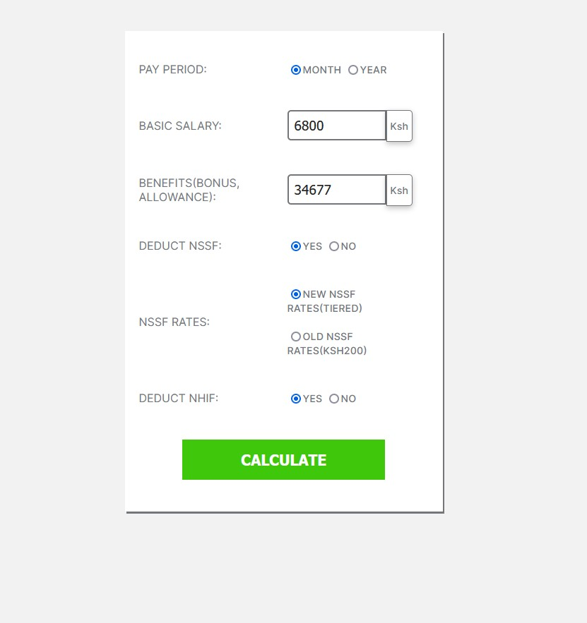
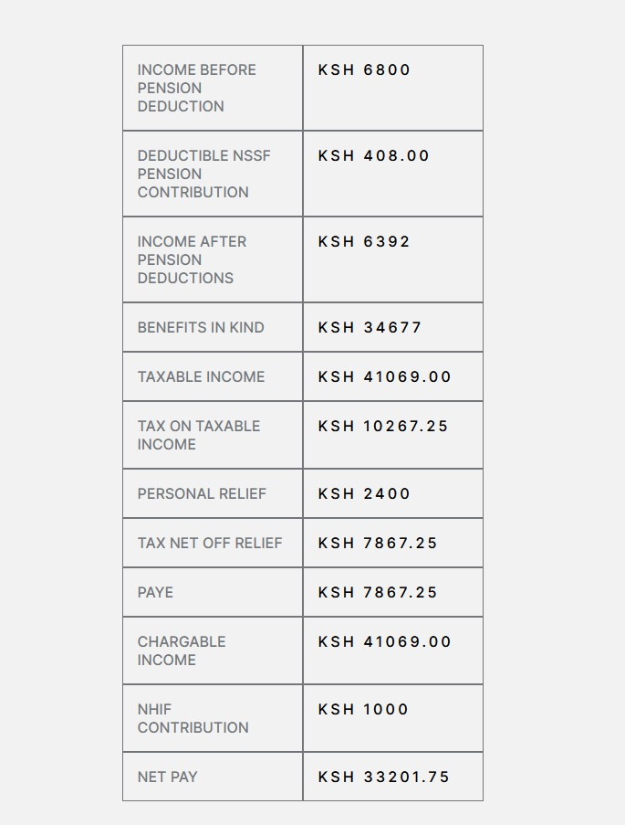

# Masterpiece Project

## A tax calculator

- A tax calculater to get the PAYE as per the 2021 taxation regulations

- Gives back the net earnings depending on the Basic Salary and Benefits as per the Monthly or Yearly pay Period

### Screenshot

- A screenshot of the Input fields
  

- A screenshot of the output
  

### Link

GHPages Link :- [Live Solution]()
